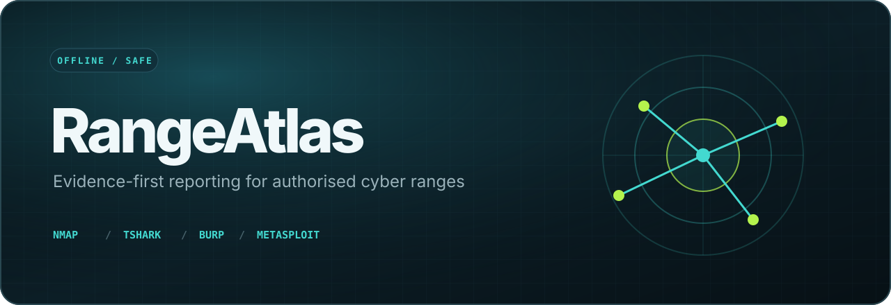
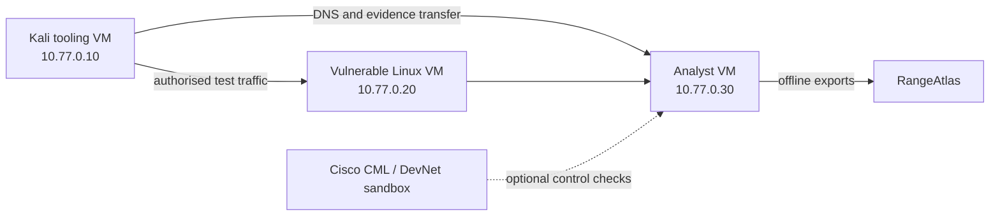

<p align="center">
  
</p>

<p align="center">
  <a href="https://github.com/ReedStel/RangeAtlas/actions/workflows/ci.yml"></a>
  
  
  
  <a href="LICENSE"></a>
</p>

RangeAtlas turns separate exports from **Nmap, TShark/Wireshark, Burp Suite, and Metasploit** into
one deterministic security report. It is designed for a small VMware or CML cyber range where every
target is owned by the operator and explicitly listed in an authorised-scope policy.

The important part is what RangeAtlas does **not** do: it never launches a scanner, proxy, packet
capture, or exploit. Evidence collection stays in the lab; correlation and reporting stay offline.

```text
Nmap XML ─────────┐
TShark JSON ──────┼──> bounded importers ──> scope gate ──> correlation ──┬──> report.html
Burp issue XML ───┤                                                       ├──> report.md
Metasploit XML ───┘                                                       └──> report.json
```

## Why this exists

Security labs often end as a folder of screenshots and unrelated tool output. RangeAtlas creates a
repeatable evidence chain:

1. discover the lab surface;
2. observe the traffic;
3. document web findings;
4. record a controlled validation;
5. apply hardening; and
6. rebuild the report to show what changed.

That makes the result useful for learning, review, and portfolio demonstrations without turning the
repository into an attack toolkit.

## Try the synthetic demo

You need Python 3.11 or newer. No external Python packages are required.

```bash
python -m venv .venv
source .venv/bin/activate          # Windows: .venv\Scripts\activate
python -m pip install -e .
rangeatlas build --manifest examples/demo/manifest.toml --out build/demo
```

Open `build/demo/report.html`. The same run also creates a stable machine-readable JSON file and a
Markdown report suitable for pull-request review.

To see the safety gate reject a public or undeclared address:

```bash
rangeatlas scope --policy config/scope.toml 10.77.0.20 8.8.8.8
```

Expected result:

```text
ALLOW 10.77.0.20                             within RangeAtlas isolated VMware lab
DENY  8.8.8.8                                public addresses are denied by policy
```

## Supported evidence

| Source | Input | Imported | Deliberately excluded |
| --- | --- | --- | --- |
| Nmap | XML (`-oX`) | hosts, state, OS estimate, ports, service metadata | command execution and NSE output |
| TShark / Wireshark | TShark JSON | protocol counts and IP conversations | payload bodies and packet bytes |
| Burp Suite | issue-export XML | title, severity, target, detail, remediation | requests, responses, cookies, tokens |
| Metasploit | workspace XML | hosts, services, vulnerabilities, session metadata | credentials, loot, task logs, payload data |

The import choices follow the tools' documented interchange formats: [Nmap XML](https://nmap.org/book/output-formats-xml-output.html),
[TShark JSON](https://www.wireshark.org/docs/man-pages/tshark),
[Burp issue XML](https://portswigger.net/burp/documentation/desktop/running-scans/reporting/report-settings),
and [Metasploit workspace XML](https://docs.rapid7.com/metasploit/exporting-and-importing-data/).

## Safety by construction

- Import-only architecture: the package has no subprocess or socket integration.
- Literal-IP allowlist: DNS names are not resolved and public addresses are rejected.
- Bounded inputs: each evidence file has a fixed size limit.
- XML hardening: entity declarations are rejected and report DTDs are discarded before parsing.
- Minimal collection: high-risk fields are ignored before they can reach the report model.
- Conservative redaction: common tokens, passwords, email addresses, and URL credentials are removed.
- Public-safe repository: all checked-in evidence is synthetic and uses `10.77.0.0/24` as a fictional
  isolated range.

Read [the evidence-handling guide](docs/evidence-handling.md) before importing anything from a real
lab. RangeAtlas must only be used with systems you own or have explicit permission to test.

## Lab design

The reference design uses a host-only VMware network with no bridge to a workplace, campus, or home
LAN:



VMware, Kali, Burp, Metasploit, Nmap, and Wireshark are covered in the
[lab guide](docs/lab-guide.md). Cisco validation is kept as an optional, read-only companion workflow
using [pyATS](https://developer.cisco.com/docs/pyats/) or a reserved
[CML sandbox](https://developer.cisco.com/docs/modeling-labs/sandbox/).

Hack The Box is intentionally not automated. The [HTB boundary](docs/htb-boundary.md) explains how
to keep private target information, VPN profiles, active-machine solutions, and flags out of the
repository.

## Honest project status

| Capability | Status |
| --- | --- |
| Offline import and correlation pipeline | Implemented and covered by synthetic tests |
| JSON, Markdown, and self-contained HTML reports | Implemented |
| Scope enforcement and evidence redaction | Implemented |
| Synthetic end-to-end demonstration | Implemented |
| Personal VMware/CML deployment evidence | Not claimed; requires a separately built local lab |
| Production use or external security assessment | Not claimed |

## Sixty-second reviewer path

1. Run the four-line demo above and open `build/demo/report.html`.
2. Read [`rangeatlas/security.py`](rangeatlas/security.py) for the scope and input boundaries.
3. Read [`tests/test_pipeline.py`](tests/test_pipeline.py) for the end-to-end contract.
4. Open [`docs/architecture.md`](docs/architecture.md) for the design trade-offs.

## Development

```bash
python -m unittest discover -s tests -v
python -m compileall -q rangeatlas
```

CI runs the suite and rebuilds the demo on Python 3.11, 3.12, and 3.13.

## Repository map

```text
rangeatlas/          Core models, safety controls, importers, correlation, and reporting
fixtures/            Synthetic exports; no live targets or captures
examples/demo/       Reproducible end-to-end manifest
config/              Authorised lab-scope policy
reports/example/     Prebuilt synthetic report for quick review
docs/                Architecture, lab, evidence, Cisco, HTB, and showcase notes
tests/               Parser, boundary, redaction, and pipeline tests
```

## Roadmap

- Compare two reports and show remediation deltas.
- Import sanitised Cisco pyATS control results.
- Add signed evidence manifests with SHA-256 hashes.
- Add a local-only dashboard for browsing historical lab runs.

## Licence

RangeAtlas is public and source-available, but it is not open-source software under an OSI-approved
licence. The included licence permits viewing, downloading, installing, and running an unmodified
copy for personal, educational, and non-commercial evaluation. It does not permit modification,
redistribution, rebranding, commercial use, or sale without written permission. See
[`LICENSE`](LICENSE) for the controlling terms.

