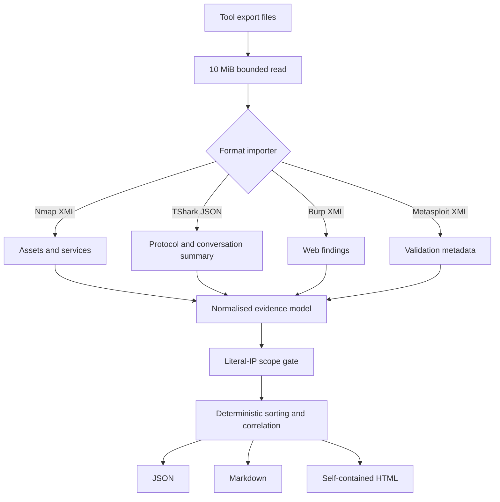

# Architecture

RangeAtlas separates **evidence collection** from **evidence interpretation**. Tool execution occurs
only inside an authorised lab under the operator's control. The repository begins at the export-file
boundary.

## Data flow

## Design decisions

### Import instead of orchestration

RangeAtlas does not call external commands or open sockets. That limits blast radius, makes CI
deterministic, and keeps tool-specific privileges outside the reporting process.

### Minimise before redacting

The safest sensitive field is one that is never imported. Burp request/response bodies and
Metasploit credential/loot elements are ignored at the parser boundary. Redaction is a second layer,
not an excuse to ingest everything.

### Scope after correlation

The manifest's declared targets are checked first. Every literal address discovered in assets,
findings, and conversations is checked again after correlation. This catches a valid-looking
manifest paired with evidence from the wrong environment.

### Stable outputs

Assets, findings, services, source filenames, and validations are explicitly sorted. A report built
from the same evidence should produce the same content, which keeps Git diffs meaningful.

### Standard library only

The runtime uses Python's standard library. This keeps setup small and reduces dependency risk. XML
entity declarations are rejected before the bounded document is parsed, while harmless internal
report DTDs are removed because they are unnecessary for extraction.

## Trust boundaries

1. Export files are untrusted input even when they came from a familiar tool.
2. The manifest is operator-controlled but still validated.
3. The normalised model contains only report-safe fields.
4. Generated reports still require human review before public sharing.

This is an educational codebase, not a hardened forensic appliance.

